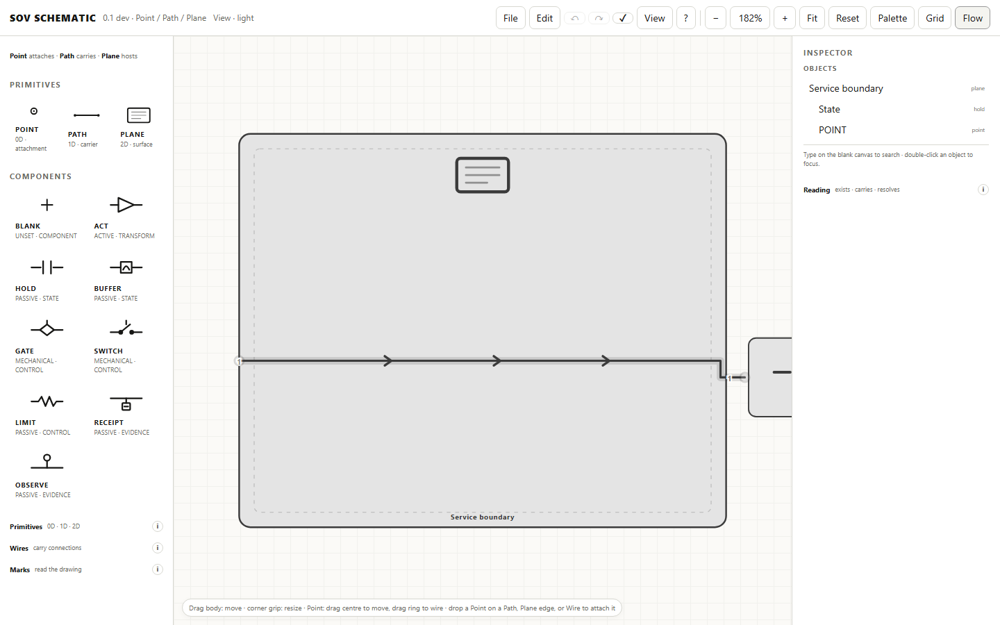
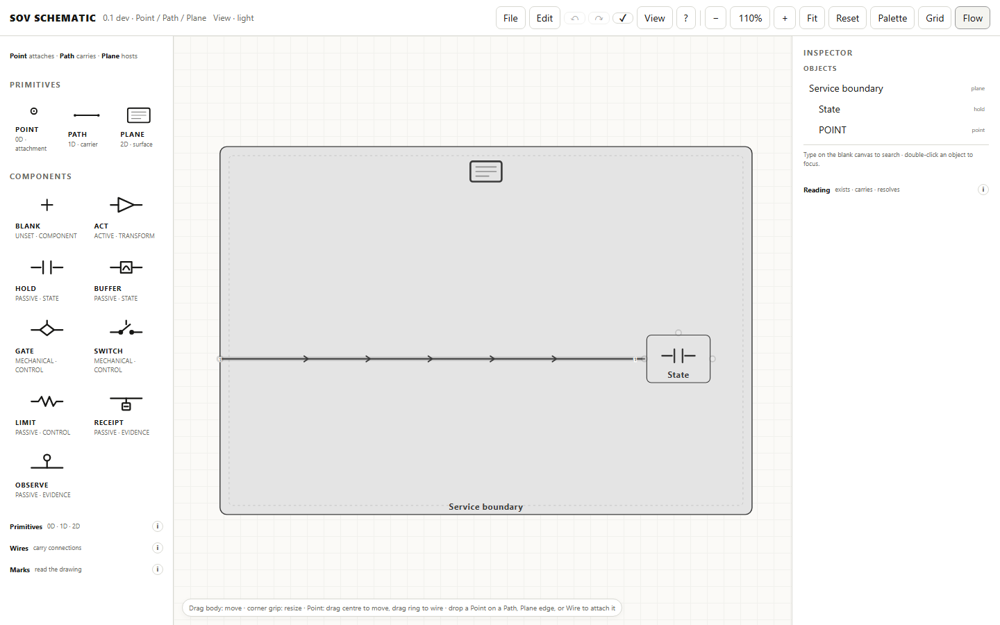
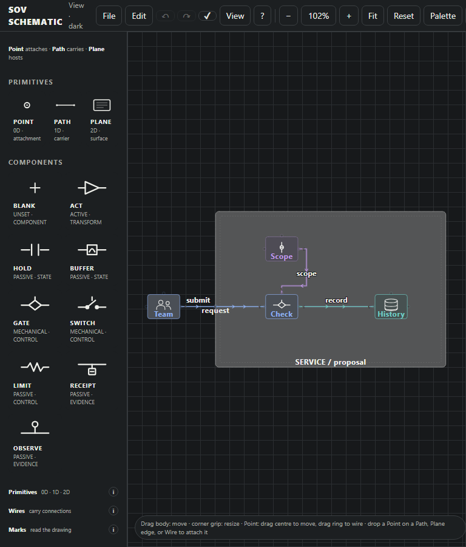

# Authoring and geometry evidence — issue #38

This change repairs four reproduced editor defects and adds a fresh authored example.
The original platform/service/commons documents and wrapper were subsequently supplied
in `swarm-schematic-review.zip`. The [original-bundle review](original-review/README.md)
records their actual before/after evidence, completed regressions and remaining rate-policy
finding. The synthetic screenshots on this page record the initial reproduction only.

Base: `dev` at `9919db62864628d0390bb18fb892ec665314a60a`, which includes fetched `main`
at `f025179bdc5d2837218c8cad02658391009d55a6`. Fetched main's `index.html` blob is still
`135579b16682fd424b15faf095794ed56391214f`, matching the handoff. The canonical local
checkout was clean and left unchanged. Implementation uses the isolated branch
`sandbox/codex-sc`, with a PR targeting `dev` per `docs/BRANCHING.md`. No merge or
release is authorized by this work.

Actual browser capability: local Playwright Chromium `143.0.7499.4` opens the normal
standalone editor from `file:` URLs and supports real file input, downloads, pointer
gestures, screenshots and SVG viewing. Tests use the editor's download fallback to
avoid an unattended OS save picker. No wrapper stylesheet was applied.

## Findings and changes

| Concern | Evidence and disposition |
| --- | --- |
| Geometry | Before: a 940 × 650 Plane becomes 520 × 420 on browser open; its boundary point moves and child falls outside. `region_dimensions_qa.py` failed on this exact disagreement. Shared size normalization in `05-data-core.js` now supplies defaults/minima without a browser-only ceiling. File load, browser CRUD, HTTP, MCP, inspector and gestures use that policy. The test checks all three reported sizes, painted rectangles, attachment parameters, membership and endpoints through real Save/reopen. |
| Readability | The existing label test multiplied font size by nominal camera zoom. Independent screen-transform measurement failed: 10-unit text was only 7.08 screen pixels at nominal 100%. Camera/panel fitting now uses the actual SVG screen scale; essential labels stay at 12–16 pixels. Bounds include descendants, local routes and projected labels/graphics. Existing pan/zoom and Objects focus remain available. No new routing engine, arrow policy or topology was introduced. |
| Authoring and color | Existing author, author-offline and reviewer instructions now require topology first, full child bounds, control lanes, explicit connection color slots and visual/reopen evidence. Corrected stale guidance that a named Plane never renders its label. The new six-component example uses requests/actions C5, authority C6, evidence C4 and a restrained M1 host. Colors accompany text and shapes. The subsequent original-file inspection confirmed absent slots and pins. |
| Pin/Lock | Direct pinned gestures refuse; unlocked semantic edits work. Existing parent movement carries pinned children. A new real-keyboard regression found off-grid snapping moved a parent 16 units but its child 24; the same snap correction now reaches descendants. Unpin, move, Undo and save/reopen are checked. Only the example's host and reference are pinned. No automatic pinning or new pin contract. |
| Ports | The example preserves the typed templates' real in/out/control affordances and explicit boundary Point. Selected custom graphics still expose port hit targets. Quiet unused ports are retained; no endpoints are hidden or removed. The original port audit is now recorded in the follow-up review. Existing port-over-resize interaction tests pass. |
| Graphics and export | Team and history are inline portable SVG presentations on `act` and `hold`, with semantic labels and ports independent. Both survive `.sov` and `.sovpak` and render in light/dark SVG. File-menu SVG export was separately reproduced as black, unstyled shapes: it lacked the headless exporter's computed styles. That existing exporter now lives in `75-persistence.js`; File menu, `file.svg()` and the headless script delegate to it. SVG sanitization is unchanged. No external assets or new topology model. |

Wrapper disposition is now established in the [follow-up review](original-review/README.md):
its component labels receive a 20px override, while `.wire-label` matches no current wire
labels. It embeds the old clamping editor. No editor fix compensates for those overrides.

The example is a proposed request/check/history circuit, not a swarm runtime or proof
of authority enforcement, branch behavior, capacity/reservation logic or external effects.

## Visual record

Synthetic large-region reproduction, before and after in the normal editor:

| Viewport/theme | Before | After |
| --- | --- | --- |
| 768 light | [before](before-768-light.png) | [after](after-768-light.png) |
| 768 dark | [before](before-768-dark.png) | [after](after-768-dark.png) |
| 1440 light | [before](before-1440-light.png) | [after](after-1440-light.png) |
| 1440 dark | [before](before-1440-dark.png) | [after](after-1440-dark.png) |




Fresh example, authored from the revised guidance and reopened through both file formats:

| Viewport | Light | Dark |
| --- | --- | --- |
| 768 | [editor](fresh-768-light.png) | [editor](fresh-768-dark.png) |
| 1440 | [editor](fresh-1440-light.png) | [editor](fresh-1440-dark.png) |



File-menu export defect: [before](native-before.png), [after](native-after.png).
Portable final exports: [light SVG](example-light.svg), [dark SVG](example-dark.svg).
Actual browser captures of those exports: [light](export-light.png), [dark](export-dark.png).

## Validation and remaining acceptance

`python scripts/qa.py` passed **47 suites and 17 JavaScript syntax checks**; see [log](qa.log).
This includes the original interaction, legality, file, API/MCP, mutation, golden and
performance gates plus the new browser regressions. The fresh example test exercises
both 768/1440 widths and both appearances, checks actual essential label size,
label/label and label/other-node overlap, port hits, pin gestures/history, semantic
edits and file/package/standalone SVG. Screenshot inspection supplements these checks;
they are not a general proof that arbitrary layouts cannot collide.

Reproduce the new checks:

```sh
python build.py
python tests/region_dimensions_qa.py
python tests/authoring_review_qa.py --out review-evidence
python scripts/qa.py
```

The [original-bundle review](original-review/README.md) supersedes the earlier missing-file
acceptance gap. It includes the native originals, repaired presentations and delegated
label-placement fix. Package rate precedence remains tracked separately in issue #40;
the four historical screenshots were not included in the supplied ZIP. No merge or
release is claimed.
