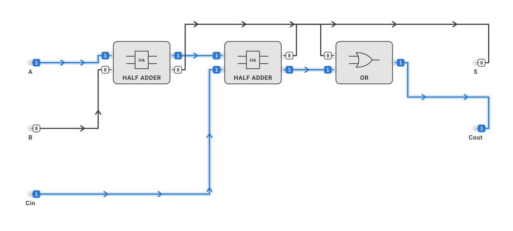

# A visual language for solvers, units and gates

> **Non-authoritative design.** Discovery and design for how optimization runs, unit simulations and logic circuits should look. It extends `OPTIMIZATION-VISUALIZATION.md` (solver views) to the simulator and the logic runtime, and fixes one grammar for all three. Nothing here is built into the editor yet.

A studies page accompanies this document: each view below was prototyped from real runs of `optimize_sov.py`, `simulate_sov.py` and `logic_sov.py` on this branch. It was published as a private artifact in the working session. The figures and findings quoted here come from it.

## Discovery: what the editor already gives us

The editor's look is restrained and ink-first, and most of what these views need already exists:

| Existing piece | Where | What it offers these views |
| --- | --- | --- |
| Palette glyphs as SVG `<symbol>`, 96 × 64, stroked in `currentColor` | `index.source.html` | the grid a gate glyph is drawn in, so glyphs follow light and dark with no extra work |
| `presentation.graphic`: a symbol reference, a custom SVG fragment (sanitized), or none | `src/55-render.js` | a pack can ship gate glyphs as data, which is Issue #4's path; no renderer code is needed |
| Theme tokens `--canvas-tone`, `--canvas-ink`, `--canvas-muted`, `--canvas-halo`, with dark twins | `styles/app.css` | the neutrals every view uses |
| `.wire-voltage`: an 8 px glow under each wire at 10% opacity | `styles/app.css`, `src/55-render.js` | the place to show a net's live value, without a new layer |
| Packets: dots moving along a wire, travel time from length and rate | `src/55-render.js` | Issue #6's "the particle is the transition" |
| Labels with a halo stroke, sized to stay legible across zoom | `styles/app.css` | value chips and annotations |
| Contrast floor (`ensureContrast`) and surface-relative ink (`themeColor`) | `src/00-state.js` | a legibility check every view can reuse |

Missing:
- **A signal color.** The canvas is monochrome apart from user-chosen connection colors.
- **Gate shapes.** Every gate draws with the generic `gate` glyph.
- **Views outside the canvas:** timing, landscape, tree, timeline.

## One grammar

Each encoding has one meaning in every view.

| Meaning | Drawn as |
| --- | --- |
| a bit that is 1 | wire in the signal color (blue), with the voltage glow |
| a bit that is 0 | wire in plain ink |
| a change in flight | a packet labelled with the change (`1→0`) |
| a level (a number) | a thin line, with the gate's thresholds or band drawn on it |
| held state or progress | a ring with one arc per requirement; it closes when the gate fires |
| a proven answer | filled mark |
| a local answer | hollow mark |
| a naive or approximate answer | cross, or a band for approximation error |
| breaks a limit / infeasible | orange hollow mark; infeasible area hatched, never colored |

**Color budget.** Three data colors, validated for color-vision deficiency in both themes on the editor's canvas tones. The worst adjacent separation is ΔE 9.2 light and 9.4 dark:

| Color | Light | Dark | Meaning |
| --- | --- | --- | --- |
| blue | `#2a78d6` | `#3987e5` | "high", "proven" and the main series |
| orange | `#eb6834` | `#d95926` | the other series, and "breaks a limit" |
| aqua | `#1baf7a` | `#199e70` | third series; below 3:1 on the light canvas, so always with a direct label |

A fourth series folds into ink, or the view is split into small multiples. Text always uses the ink tokens, never a series color.

## The views

### Logic

1. **Gate glyphs.** Two families:
   - **Distinctive shapes (ANSI/IEEE 91)** for the eight familiar gates: AND, OR, XOR, NOT, NAND, NOR, XNOR, BUFFER. They read at canvas zoom without labels.
   - **Rectangles with qualifiers (IEC 60617)** for everything else: `≥2` majority, `Σ≥θ` threshold, `MUX`, `≥θ` compare, `C` C-element, the hysteresis loop for the Schmitt trigger, and pin letters with a clock wedge for flip-flops and latches.

   Both families use the same 96 × 64 grid and 2 px stroke. Any gate drawn smaller than about 40 px falls back to the rectangle. Glyphs ship in the logic pack and are applied through `presentation.graphic`.
2. **Live state on the canvas.**
   - Wire color is the net's value.
   - A packet is a change moving, and never carries state: once it arrives, the wire color is the only record. A frozen frame therefore still reads correctly.
   - Pin chips show values at gate pins, so a truth table can be checked by eye.
3. **Timing diagram.** The primary view for anything sequential. It has one lane per signal and a **value lane** for each bus, which decodes the bits into a number and shades transient wrong values, the logic-analyzer convention. In the study, the whole-run view cannot tell the ripple counter from the synchronous one; the zoom on 7 → 8 shows the ripple counter passing through 6, 4 and 0 while the synchronous counter's outputs change together.
4. **Level views.** Any gate that reads a level draws its thresholds on the level's trace. A hysteresis gate gets its transfer loop as its detail view. In the study, the band on the trace shows why the comparator chatters: 18 switches against the Schmitt trigger's 3 on the same noisy swing.
5. **Truth table and state table** as the detail view of any gate, from the pack's own rows. Not prototyped yet.

### Execution (unit simulator)

1. **Worker timeline.** Lanes per stage and one bar per unit, from start of work to gate firing. The time axis is labor hours, since there is one worker. Budget lines and the stall are drawn with their reason: "stalled 37.13 h: timber ran out". The learning curve shows as chairs getting shorter; congestion as blanks getting longer.
2. **Unit progress ring.** One arc per requirement (materials, work), with the completion gate at the centre. It is used both in the timeline's detail and on the stage in the plan overlay.
3. **Stock and count lanes** (not prototyped): stock per stage and cumulative counts, stepping in whole units.

### Solvers

These are the views in `OPTIMIZATION-VISUALIZATION.md`, now drawn in the shared grammar:
- **Landscape.** Value as a single-hue ramp and infeasible area hatched. Limits are drawn as the curves they are: labor bends and timber is straight. It also shows:
  - whole-unit dots, with local optima ringed;
  - climbs colored by the optimum they end in;
  - proven optima filled and naive plans crossed.
- **Search tree as an outline**, indented by depth, one row per node:
  - the branch in words (`chairs ≥ 14`, `piece 15 full`);
  - the outcome as a mark: branched, incumbent, pruned or infeasible;
  - a bar for the LP bound;
  - a dashed line at the incumbent.

  A drawn tree gets crowded after about 30 nodes; an outline stays readable and works on a phone. A bound-against-incumbent chart sits beside it.
- **Convergence.** Plan value under the true curves against the number of pieces, one panel per model, never on a dual axis. A plan that breaks a limit is an orange hollow mark with a label: in the study, the learning-curve model at 20 pieces.

## How the views are built

- **Every view is a projection of a record.** The records exist or are now recorded:

  | Record | Source |
  | --- | --- |
  | optimizer run | `solve`, `local_search(record=True)` (climb paths), `branch_and_bound(log=…)` (node log) |
  | unit simulation | the `.sav` event log |
  | circuit run | `Circuit.apply(record=True)` events |

  A view that needs a number the record lacks changes the record, not the view.
- **One projection per view**, pure: record in, SVG out, deterministic. Headless first, as standalone SVG files in the manner of `export_svg.py`; the same functions later feed a run page and, after the RC, the editor.
- **Tokens, not literals.** Every color comes from the editor's tokens plus the three data colors, with light and dark defined together.
- **Checked like the exports.** Each view gets a QA suite that checks the picture's claims against the record, by a path the renderer did not choose:
  - a value lane's labels equal the decoded bits;
  - a landscape's filled marker sits at the proven plan;
  - an outline's rows equal the log;
  - a timeline bar spans a unit's start and completion events.

  Plus determinism, and the contrast floor in both themes.

## Decided in the bake-off

The bake-off put two or three contenders per view side by side, drawn from the same real runs, each round ending with a recommendation. Responses:

| Round | Response | What was built |
| --- | --- | --- |
| Gate glyphs | agreed | hybrid: distinctive shapes for AND, OR, XOR, NOT, NAND, NOR, XNOR, BUFFER; IEC rectangles with qualifiers for everything else; every gate also carries its rectangle for sizes below about 40 px |
| Live signal state | agreed | wire colour and glow carry state, high wires 0.6 px heavier, pin chips; monochrome by weight alone |
| Behaviour over time | agreed | timing diagram with a value lane per bus, transients shaded, linked to the event log |
| Level gates | agreed | the trace with each reader's thresholds and outputs; a hysteresis gate's transfer loop as its detail |
| Solver landscape | agreed | heatmap, labelled contours near the top, limits drawn where their slack is zero, and the ranked table beneath |
| Search | **delta** | see below |
| Unit execution | agreed | worker timeline with a progress-against-target strip; the labor split as a ledger row |

**The search delta.** The response: *"I don't like C as much, the tree is somewhat clear if dead branches rendered different. We should also consider gradient maps to update C."* Read as:
- keep the **outline**;
- bring back the **node-link tree**, with dead branches (pruned and infeasible) drawn dead: dashed edges, dotted hollow or crossed nodes, struck-through labels in the outline;
- replace the bound-against-incumbent chart with a **gradient map**: every live node, on both the outline and the tree, is shaded by how close its LP bound came to the final incumbent (strong near it, faint far from it), so "how far from done" is read on the tree itself.

## Built

| Piece | File | Checked by |
| --- | --- | --- |
| Glyphs as pack data (`glyph`, `glyph_small`, `glyph_family` per gate), written into the pack and applied by the example builder as `presentation.graphic` | `scripts/logic_glyphs.py`, `packs/logic/gates.json` | `tests/plot_run_qa.py` (sanitizer allowlist, family rule, examples carry them); `tests/logic_state_export_qa.py` (every gate keeps its glyph through the editor, both themes) |
| Run records, one kind per domain, naming the document by fingerprint | `scripts/record_run.py`; `landscape()` and the shared `_decision_space()` in `scripts/optimize_sov.py` | `tests/plot_run_qa.py` |
| The views: timing and event log, level trace and transfer loop, landscape and table, search outline and tree, timeline, glyph sheet, and a run page that links them | `scripts/plot_run.mjs` (plain JavaScript, record in, SVG out; runs under Node now and in a page or the editor later) | `tests/plot_run_qa.py`: every view's claims against the record, determinism, both themes |
| Live signal state on the editor's own export | `scripts/export_svg.py --logic-state A=1,B=1 [--monochrome]` | `tests/logic_state_export_qa.py`: every input of the half adder against its definition, one chip per pin, no packets in a snapshot, no signal colour in monochrome |
| Gallery | `docs/visual/`, from `scripts/build_visual_gallery.py` | `--check` inside `tests/plot_run_qa.py` |
| Size rule: a gate's glyph drawn under 40 px shows its rectangle (`svgSmall`), following the camera | `applyGlyphSizeRule` in `src/55-render.js`; `view.zoom()` / `view.setZoom()` in the API | `tests/glyph_size_rule_qa.py`: one variant per gate at every zoom, the small one exactly when height x zoom < 40 |
| Composite parts as IEC boxes, qualified by their own document (HA, FA, Σ4, RG4, ...) | `composite_glyph()` in `scripts/logic_glyphs.py`, applied by `scripts/build_logic_examples.py` | `build_logic_examples.py --check` |
| Landscape slices for more than two decisions: every pair, the rest held at the whole-unit plan, labelled as a slice | `landscape(pair=, held=)` in `scripts/optimize_sov.py`; `record_optimize` | `tests/plot_run_qa.py` (held values, projected marks, true values at named plans) |
| Live logic state in the editor: wires high in the signal colour and low in ink, a chip at every pin shown on hover, selection or zoom ≥ 100% (always on inputs, where it is the switch) | `src/57-logic-live.js` over the shared runtime `src/07-logic-core.js`; `SovSchematicAPI.logic` and MCP `schematic.logic.run` | `tests/logic_live_qa.py` (browser, against the definition and `logic_sov.py`); `tests/logic_core_parity_qa.py` (event for event with `logic_sov.py`); `tests/logic_mcp_qa.py` |
| Step-through on the run page: timing event by event (cursor, lane mark, log row, bus value), search node by node in the order decided (later nodes fade in outline and tree) | `STEPPER` in `scripts/plot_run.mjs` | `tests/run_page_qa.py` (browser) against the record; `tests/plot_run_qa.py` (step order is log order) |

Making the tests fail on purpose (transient detection off, pruned nodes drawn live) fails them. Two defects surfaced while building: a bare `&` in the IEC AND qualifier made the glyph markup unparseable, which in the editor would have silently fallen back to the generic symbol; and monochrome exports still named the signal colour for the hidden glow.

### Gallery

The glitch the value lane exists for: the ripple counter passing 6, 4 and 0 on its way from 7 to 8.


The search, with dead branches drawn dead and the bound gradient:


The landscape of the learning-curve workshop: limits where their slack is zero, contours near the top, whole-unit local optima ringed, climbs coloured by where they end.


Live state on the editor's own export, full adder with A = 1, B = 0, Cin = 1:



Also in `docs/visual/`: `glyphs.svg`, `timing-sync-counter.svg`, `level-schmitt.svg`, `loop-schmitt.svg`, `search-outline.svg`, `timeline-week.svg`, `live-state-full-adder-mono.svg`. Standalone files follow the viewer's colour scheme.

### Try it

```
python scripts/record_run.py logic examples/logic/ripple-counter4.sov --clock CLK --pulses 17 --bus Q --out ripple.json
python scripts/record_run.py logic examples/logic/schmitt.sov --wave X --out schmitt.json
python scripts/record_run.py optimize examples/optimization/workshop.sov --model examples/optimization/workshop.learning.opt.json --out learning.json
python scripts/record_run.py simulate examples/optimization/workshop.sov --model examples/optimization/workshop.learning.opt.json --target chairs=14,tables=2 --out week.json
node scripts/plot_run.mjs ripple.json schmitt.json learning.json week.json --out views/ --page runs.html
python scripts/export_svg.py examples/logic/half-adder.sov --logic-state A=1,B=1
```

Live in the editor (open `examples/logic/half-adder.sov`, then in the console or through the API):

```
SovSchematicAPI.logic.live.start({A: 1, B: 0})   // click an input's chip to flip it
SovSchematicAPI.logic.run({steps: [{set: {A: 1, B: 1}}]})
```

## Residuals

| Gap | What closes it |
| --- | --- |
| The run views (timing, landscape, search, timeline) live on the run page, not in the editor | a decision on where: a panel beside the canvas, a second tab, or a mode of the canvas itself; `scripts/plot_run.mjs` is already plain JavaScript with no dependencies |
| A logic edit restarts a live circuit from power-on, so a latched value is lost | carry state by gate id across a rebuild where the gate survives unchanged |
